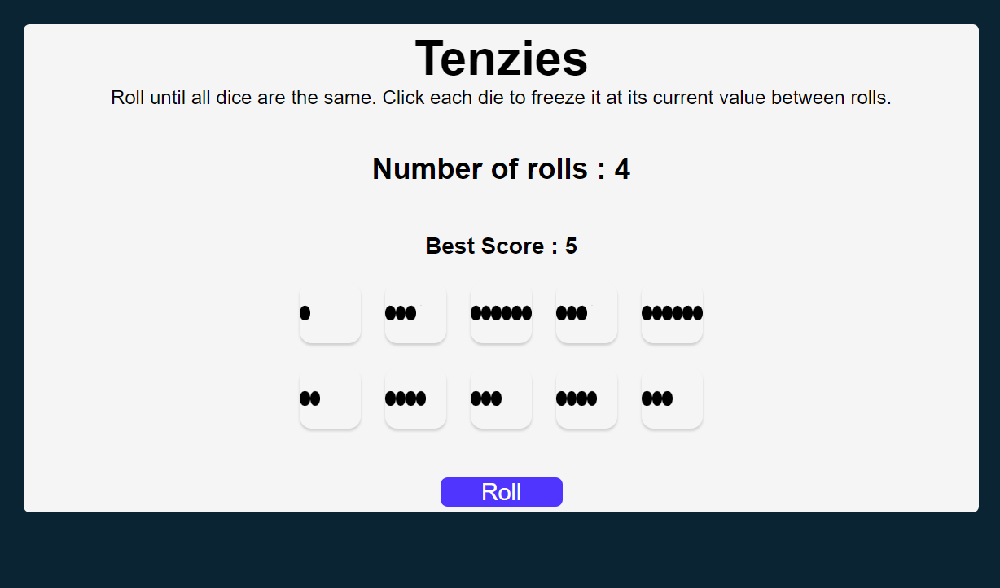

# Tenzies

Welcome to Tenzies ! This is a modern and feature-rich React web application that allows users to play tenzies .
-----------------------------Roll the dice, take a chance, and let the Tenzies dance!--------------------------

## User Interface

### Home Page

## Installation

To run AwesomeApp locally, follow these steps:

1. Clone the repository: `git clone https://github.com/abhishekchauhanbyte/Tenzies.git`
2. Install dependencies: `cd tenzies && npm install`
3. Set up environment variables: Create a `.env` file in the root directory and add the required variables (e.g., API keys, database connection).
4. Start the development server: `npm start`
5. Open `http://localhost:3000` in your browser.

## Contributing

Contributions are welcome! If you encounter any bugs or have suggestions for improvements, please open an issue or submit a pull request. 

## Contact

If you have any questions or need assistance, feel free to reach out to me at abhichauhan.bij@gmail.com.

